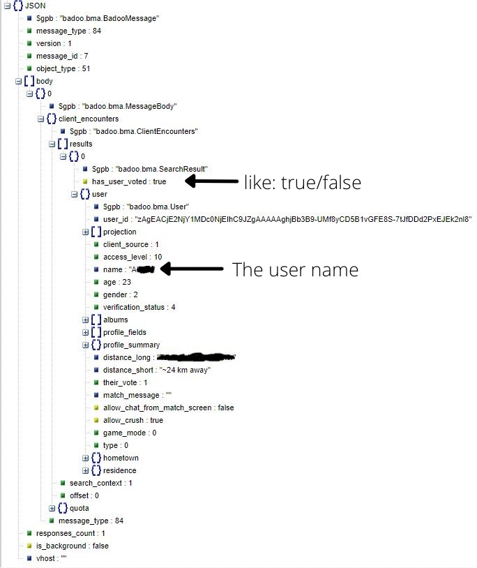

# How to see who likes you on Bumble

## ⚠️ Disclaimer ⚠️

I DO NOT take any responsibility for security issues or bans.

## How it's works:

1. Go to bumble.com and sing in
2. Open your developer tools at the **Network** tab
3. Search for url that end with **"/mwebapi.phtml?SERVER_GET_ENCOUNTERS"**
4. Click on the url and go to the **Response**
5. Copy the text to **JSON Reader** and paste the text

### Example of the data:

