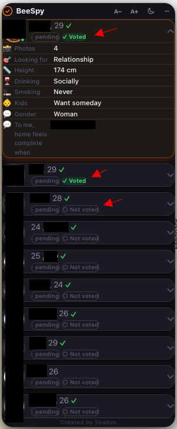

<div align="center">


# BeeSpy

**See what the app hides. Swipe smarter.**

A lightweight Chrome extension that surfaces real-time profile data directly from Bumble's server — displayed in a clean floating panel while you swipe.

<br/>



<br/>

[](https://developer.chrome.com/docs/extensions/)
[](https://developer.chrome.com/docs/extensions/mv3/intro/)
[](https://github.com/seadox)

</div>

---

## What It Shows

Every profile loaded into your swipe queue is displayed in a live stack — not just the current card, but all upcoming profiles the app has already fetched.

| Field | Description |
|---|---|
| **Name, age, verification** | Instantly visible on each card |
| **Voted status** | Whether this person has already voted on your profile |
| **Your vote** | Like / Pass / Super — shown the moment you swipe |
| **Looking for** | Relationship, hookup, friends, etc. |
| **Height, drinking, smoking, kids** | All lifestyle fields |
| **Exercise, star sign, politics, education** | Additional lifestyle data |
| **About me** | Their bio text |
| **Open-ended answers** | Any question prompts they've answered |
| **Photo count** | Number of photos on their profile |

Profiles are removed from the stack the instant you swipe, keeping the queue perfectly in sync.

---

## Installation

> Requires Google Chrome with Developer Mode enabled.

1. [Download the latest release](../../releases) as a ZIP and extract it, or clone the repository
2. Open Chrome and navigate to `chrome://extensions/`
3. Enable **Developer mode** using the toggle in the top-right corner
4. Click **Load unpacked** and select the extracted folder
5. Navigate to Bumble and go to the swipe page

---

## Usage

| Action | How |
|---|---|
| **Move the panel** | Click and drag the header bar |
| **Collapse / expand** | Click the `−` / `+` button |
| **Toggle dark mode** | Click the sun / moon icon |
| **Adjust font size** | Click `A−` or `A+` in the header |
| **Expand a profile** | Click any card to see full details |

All preferences (theme, font size) are saved automatically and restored on your next visit.

---

## How It Works

Bumble's web app communicates with its backend via `XMLHttpRequest` to `/mwebapi.phtml` using the `badoo.bma.BadooMessage` RPC protocol.

The extension wraps `XMLHttpRequest.prototype.open` and `.send` at the page's JavaScript level to read both outgoing votes and incoming profile batches before the app processes them.

**Incoming data** (message type `84`) carries a `has_user_voted` flag per profile — a field the app's internal parser silently drops. BeeSpy captures it directly from the raw response.

**Outgoing votes** (message type `80`) are intercepted the moment you swipe, so the matching profile is removed from the panel queue immediately — no waiting for the next server round-trip.

The extension runs in `"world": "MAIN"` (Manifest V3) so its XHR prototype patches share the same JavaScript context as the Bumble app itself.

---

## Debug

Open DevTools on your Bumble run:

```js
// All profiles in queue order
window.__beeSpy.orderedProfiles()

// Raw profile store (Map: userId → profile object)
window.__beeSpy.store

// Ordered userId array
window.__beeSpy.order
```

---

<div align="center">

Created by **Seadox**

</div>